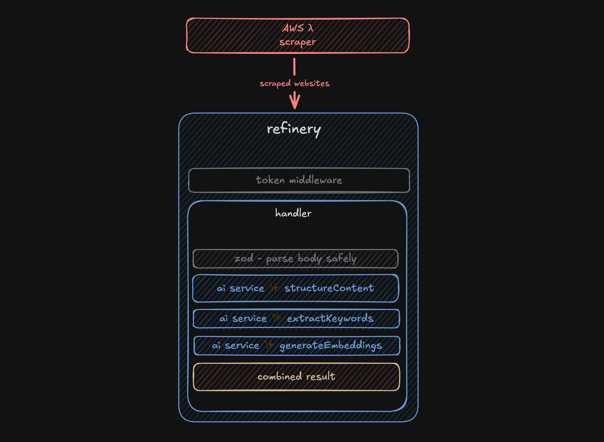

# Refinery Pipeline

A serverless data pipeline processor running on AWS Lambda that enriches scraped website content using AI. Built with TypeScript, Hono, and the Vercel AI SDK.

## Architecture Overview



## Features

- **Content Structuring**: Organizes raw scraped content into structured data
- **Keyword Extraction**: Identifies relevant keywords and entities
- **Embedding Generation**: Creates vector embeddings for semantic search
- **Serverless Architecture**: Deployed on AWS Lambda with minimal cold start
- **Type Safety**: Full TypeScript implementation with strong typing

## Project Structure

```
├── src/
│   ├── lib/
│   │   ├── types.ts          # Type definitions
│   │   └── ai-service.ts     # AI processing service
│   ├── test/
│   │   ├── sample-data.ts    # Test data samples
│   │   └── local-test.ts     # Local testing utilities
│   ├── index.ts              # Lambda handler with Hono routing
│   └── processor.ts          # Main content processing logic
├── serverless.yml            # Serverless Framework configuration
├── tsconfig.json            # TypeScript configuration
└── package.json             # Dependencies and scripts
```

## Setup

### Prerequisites

- Node.js 22+
- pnpm (package manager)
- AWS CLI configured
- OpenAI API key

### Installation

1. Clone the repository:

```bash
git clone <repository-url>
cd refinery-pipeline
```

2. Install dependencies:

```bash
pnpm install
```

3. Set up environment variables:

```bash
cp .env.example .env
# Edit .env with your API keys
```

4. Configure AWS credentials:

```bash
aws configure
# Or set AWS_PROFILE if using named profiles
```

### Local Development

1. Test the processor locally:

```bash
export OPENAI_API_KEY=your_key_here
pnpm test:local
```

2. Test different configurations:

```bash
pnpm test:configs
```

3. Build the project:

```bash
pnpm build
```

## Deployment

### Development Environment

```bash
pnpm deploy:dev
```

### Production Environment

```bash
pnpm deploy:prod
```

## API Endpoints

### POST /process

Processes scraped website content with AI enrichment.

**Authentication Required:** Include your API token in the request.

**Request Headers:**

```
Authorization: Bearer your_api_token_here
```

or
**Query Parameter:**

```
?token=your_api_token_here
```

**Request Body:**

```json
{
  "scrapingResponse": {
    "success": true,
    "timestamp": "2025-08-31T16:19:09.708Z",
    "sitesProcessed": 1,
    "totalSitesConfigured": 1,
    "results": [
      {
        "name": "Site Name",
        "url": "https://example.com",
        "title": "Page Title",
        "content": "Scraped content...",
        "contentLength": 1000,
        "scrapedAt": "2025-08-31T16:19:09.708Z",
        "keywords": ["keyword1", "keyword2"],
        "status": "success"
      }
    ],
    "executionTime": 2000
  },
  "options": {
    "generateEmbeddings": true,
    "extractKeywords": true,
    "structureContent": true,
    "model": "gpt-4o-mini"
  }
}
```

**Response:**

```json
{
  "success": true,
  "timestamp": "2025-08-31T16:20:15.123Z",
  "resultsProcessed": 1,
  "results": [
    {
      "id": "processed_123456789",
      "url": "https://example.com",
      "domain": "example.com",
      "structured": {
        "title": "Processed Title",
        "summary": "Content summary...",
        "mainTopics": ["topic1", "topic2"],
        "keyInsights": ["insight1", "insight2"],
        "dataPoints": [
          {"label": "Value", "value": "123", "category": "metric"}
        ],
        "sentiment": "neutral"
      },
      "keywords": ["keyword1", "keyword2", "keyword3"],
      "embeddings": [0.1, 0.2, 0.3, ...],
      "processingMetadata": {
        "processedAt": "2025-08-31T16:20:15.123Z",
        "processingTime": 3000,
        "model": "gpt-4o-mini",
        "success": true
      }
    }
  ],
  "executionTime": 3500
}
```

### GET /health

Health check endpoint. No authentication required.

## Configuration

### Processing Options

- `generateEmbeddings`: Generate vector embeddings (default: true)
- `extractKeywords`: Extract relevant keywords (default: true)
- `structureContent`: Structure content into organized data (default: true)
- `model`: AI model to use (default: "gpt-4o-mini")
- `maxTokens`: Maximum tokens for AI requests (optional)

### Environment Variables

- `OPENAI_API_KEY`: OpenAI API key (required)
- `API_TOKEN`: API token for authentication (required)
- `STAGE`: Deployment stage (dev/prod)

## Usage Examples

### Basic Processing

```typescript
const response = await fetch("https://your-api-gateway-url/process", {
  method: "POST",
  headers: {
    "Content-Type": "application/json",
    Authorization: "Bearer your_api_token_here",
  },
  body: JSON.stringify({
    scrapingResponse: yourScrapingData,
    options: {
      generateEmbeddings: true,
      extractKeywords: true,
      structureContent: true,
    },
  }),
});
```

### Using Query Parameter Authentication

```typescript
const response = await fetch(
  "https://your-api-gateway-url/process?token=your_api_token_here",
  {
    method: "POST",
    headers: { "Content-Type": "application/json" },
    body: JSON.stringify({
      scrapingResponse: yourScrapingData,
      options: {
        generateEmbeddings: true,
        extractKeywords: true,
        structureContent: true,
      },
    }),
  }
);
```

### Minimal Processing (Structure Only)

```typescript
const response = await fetch("https://your-api-gateway-url/process", {
  method: "POST",
  headers: {
    "Content-Type": "application/json",
    Authorization: "Bearer your_api_token_here",
  },
  body: JSON.stringify({
    scrapingResponse: yourScrapingData,
    options: {
      generateEmbeddings: false,
      extractKeywords: false,
      structureContent: true,
    },
  }),
});
```

## Development Commands

- `pnpm build`: Build the TypeScript code
- `pnpm test:local`: Test processor with sample data
- `pnpm test:configs`: Test different processing configurations
- `pnpm test:token`: Test token validation middleware
- `pnpm deploy:dev`: Deploy to development environment
- `pnpm deploy:prod`: Deploy to production environment
- `pnpm logs`: View Lambda function logs
- `pnpm remove`: Remove deployed stack

## Architecture

The pipeline follows a serverless architecture:

1. **API Gateway** receives HTTP requests
2. **Lambda Function** processes requests using Hono framework
3. **AI Service** structures content and generates embeddings
4. **Response** returns enriched data for storage/indexing

## Future Enhancements

- Vector database integration (Pinecone, Weaviate)
- Batch processing for multiple results
- Webhook support for real-time processing
- Additional AI providers (Anthropic, etc.)
- Caching layer for processed content

## License

ISC
